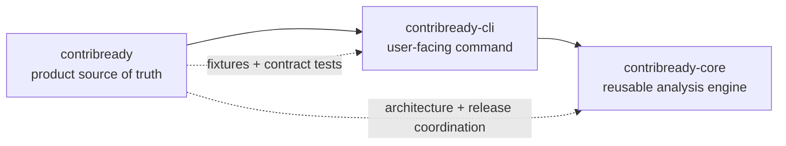

<div align="center">
  
</div>

<div align="center">
  <strong>Can a new contributor realistically succeed in this repository?</strong><br />
  ContribReady answers with bounded evidence, explainable findings, and actionable next steps.
</div>

<br />

<div align="center">
  <a href="https://github.com/ContribReady/contribready/actions/workflows/ci.yml"></a>
  <a href="https://github.com/ContribReady/contribready-core"></a>
  <a href="https://github.com/ContribReady/contribready-cli"></a>
</div>

# ContribReady

ContribReady is a deterministic CLI that answers: **can a new contributor realistically succeed in this repository?**

It audits contributor-facing evidence—setup, testing, contribution workflow, security guidance, and issue specificity—and produces explainable findings, a documented score, and the next fixes to make.

## Workspace

This repository is the main ContribReady source-of-truth repository. Its filesystem parent is only a workspace container, not a Git repository. The workspace contains this repository plus two independently maintained supporting repositories:

```mermaid
flowchart LR
  A[Repository files and issue evidence] --> B[contribready-cli]
  B --> C[@contribready/core]
  B --> D[GitHub adapter]
  C --> E[Findings, score, recommendations]
```

- [`contribready`](https://github.com/ContribReady/contribready): product mission, architecture, roadmap, project state, documentation, release coordination, examples, and integration fixtures.
- [`contribready-core`](https://github.com/ContribReady/contribready-core): independently reusable deterministic analysis library.
- [`contribready-cli`](https://github.com/ContribReady/contribready-cli): independently deployable CLI, including local inspection, reporting, and the optional GitHub adapter.

The dependency direction is CLI → Core. The GitHub adapter is a CLI-owned optional integration and is not a separate repository until it has an independently reusable/deployable contract.

## Start here

| If you want to… | Start with… |
|---|---|
| Understand the product and architecture | [Documentation map](docs/README.md) · [Architecture](docs/ARCHITECTURE.md) · [Requirements](docs/REQUIREMENTS.md) |
| Run the CLI | [CLI repository](https://github.com/ContribReady/contribready-cli) · use the published CLI after release |
| Understand the analysis engine | [Core repository](https://github.com/ContribReady/contribready-core) · use the published package after release |
| Review safety boundaries | [Security threat model](docs/SECURITY_THREAT_MODEL.md) |
| See how results are tested | [Fixture catalog](docs/FIXTURE_CATALOG.md) · [Contract tests](tests/contract.test.mjs) |
| Contribute or propose funded work | [Contributing](CONTRIBUTING.md) · [Grant submission guide](docs/GRANT_SUBMISSION.md) |

## The repository family

ContribReady is one product with three clear ownership boundaries:



The parent workspace is only a navigation folder. It is not a fourth repository. See the [repository map](docs/REPOSITORY_MAP.md) for the exact boundary decisions.

## Why it is useful

Contributor experience is part of project quality. A repository can have working code and still be difficult to enter because setup, testing, contribution, security, or issue expectations are missing. ContribReady makes that surface area reviewable without executing the target project.

## v0.1 promise

Static local repository audits and local Markdown issue audits are deterministic, safe, and explainable. No arbitrary repository code, package install script, test suite, network request, or AI judgment is required for the default audit.

See [PROJECT_STATE.md](PROJECT_STATE.md), [ROADMAP.md](ROADMAP.md), and [docs/REQUIREMENTS.md](docs/REQUIREMENTS.md).

## Submission and repository map

For the exact ownership boundaries and local layout, see [docs/REPOSITORY_MAP.md](docs/REPOSITORY_MAP.md). For grant-facing preparation, see [docs/GRANT_SUBMISSION.md](docs/GRANT_SUBMISSION.md). The main repository is the product and submission entry point; Core is the reusable engine; CLI is the executable product.

## Status

Phase 15 is complete: the core contracts, safe CLI foundation, bounded repository evidence inventory, readiness rules, versioned scoring/recommendations, opt-in GitHub retrieval, abuse-handling controls, representative fixtures, cross-package contract tests, independent CI, package metadata, compatibility targets, release audit, external contributor pathways, SARIF output, expanded ecosystem evidence, and richer GitHub issue metadata are complete. Phase 16+ long-term development is next. See [FINAL_AUDIT.md](FINAL_AUDIT.md), [docs/EXTERNAL_CONTRIBUTOR_AUDIT.md](docs/EXTERNAL_CONTRIBUTOR_AUDIT.md), and [docs/SARIF.md](docs/SARIF.md).

## License

The three repositories are independently licensed under MIT for v0.1.
