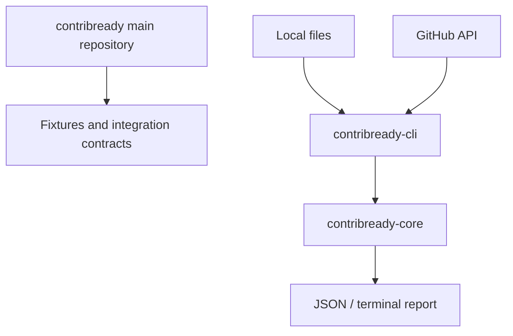

# Architecture

The main repository owns the product source of truth and coordination artifacts. Core accepts normalized evidence and issue documents. CLI owns filesystem access, presentation, and optional GitHub transport/authentication. Core has no Node filesystem, HTTP, GitHub, or CLI dependency. GitHub becomes a separate repository only after a documented independent reuse, release, and contributor boundary exists.

Phase 2 CLI modules are separated by responsibility: `args.ts` parses and validates options, `input.ts` performs bounded local reads, `output.ts` renders reports/errors, `errors.ts` owns stable error codes, and `index.ts` coordinates the command flow. Phase 3 extends `input.ts` into a bounded evidence engine while `core/src/evidence.ts` classifies normalized relative paths without filesystem access. It reads contributor-relevant files only: README/documentation, manifests, lockfiles, workflows, tests, templates, and policies. It skips source files, dependency/build directories, symlinks, oversized files, and traversal beyond configured limits.

Phase 8 scoring and recommendations are Core-owned. CLI selects repository rules for repository audits and issue rules for issue audits, then renders the versioned Core report. CLI does not recalculate category weights or reorder recommendations.

Phase 9 adds `contribready-cli/src/github/index.ts` as an adapter boundary. Canonical HTTPS GitHub repository and issue URLs opt into REST retrieval; local paths remain offline. The adapter normalizes GitHub issues into Core `IssueEvidence` and bounded classified repository files into Core `RepositoryEvidence`. Authentication is read from `GITHUB_TOKEN` only when present. HTTP status classes become stable CLI errors, and the token never enters an error, report, or Core contract. The adapter remains in the CLI repository because it is coupled to CLI input, transport, and presentation concerns; no independent package or repository boundary is justified yet.

Phase 15 adds CLI-owned SARIF rendering, Core static ecosystem classification expansion, and additive GitHub issue metadata (`state`, `locked`, `comments`, author association, and sorted labels) without changing rule input semantics. SARIF is a projection of the existing report contract. Optional dynamic execution remains a documented future design only; it is not part of Core or CLI.
